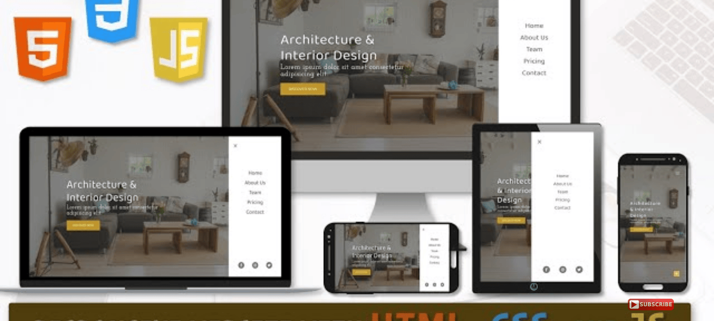

# ARCHITECT-WEBSITE

This is a CSS(Responsive Design) Challenge project.

## Table of contents

- [Overview](#overview)
  - [The challenge](#the-challenge)
  - [Screenshot](#screenshot)
  - [Links](#links)
- [My process](#my-process)
  - [Built with](#built-with)
  - [What I learned](#what-i-learned)
  - [Continued development](#continued-development)
  - [Useful resources](#useful-resources)
- [Author](#author)
- [Acknowledgments](#acknowledgments)

## Overview

### The challenge

Users should be able to:

- View the optimal layout for the site depending on their device's screen size
- See hover states for all interactive elements on the page.

### Screenshot



### Links

- Solution URL: [https://github.com/michojekunle/ARCHITECT-WEBSITE/](https://github.com/michojekunle/ARCHITECT-WEBSITE/)
- Live Site URL: [https://architect-website-nine.vercel.app/](https://architect-website-nine.vercel.app/)

## My process

### Built with

- Semantic HTML5 markup
- CSS3 
- Flexbox
- CSS Grid
- Desktop-first workflow
- [Vanilla-tilt](https://micku7zu.github.io/vanilla-tilt.js/) - JS library

### What I learned

In the course of this Project as Interesting and Refreshing as it was, I grabbed a few Important concepts such as:
- Effectively Building Responsive websites and apps with vanilla css.
- Utilizing Vanilla-tilt.js to add interesing tilt effects to the teams section of the project. 

To see how you can add code snippets, see below:

```html
  <a href='#' data-content='home'></a>
  <div class="card" data-tilt-glare data-tilt-max-glare="0.8"></div>
```
```css
.proud-of-this-css 
  a::after {
    content: attr(data-content);
  }

```
<!-- ```js
const proudOfThisFunc = () => {
  console.log('🎉')
} -->

### Continued development
```
Going forward, I'll be working on more animated, responsive, dynamic and interactive websites with vanilla CSS and other CSS & JS Libraries.
```


### Useful resources

- [Resource 1 (The Effect on mouse Over)](https://www.youtube.com/watch?v=UqEmFSlx4ps) - This helped me for understand vanill-tilt.js and building this effect from scratch. I really liked this pattern and will use it going forward.
- [Resource 2 (Customizing Scrollbar)](https://css-tricks.com/almanac/properties/s/scrollbar/) - This is an amazing article. I'd recommend it to anyone still learning this concept.
- If you want more help with writing markdown, we'd recommend checking out [The Markdown Guide](https://www.markdownguide.org/) to learn more.


## Author

- Website - [AMD](https://github.com/michojekunle)
- Twitter - [@MichaelOjekunl2](https://www.twitter.com/MichaelOjekunl2)
- LinkedIn - [Michael Ojekunle](https://www.linkedin.com/in/michael-ojekunle-651a8a232/)


## Acknowledgments

Special Credits to 
- [Code and Create](https://youtube.com/@codeandcreate)
- [Coding Journey](https://youtube.com/@CodingJourney)
- [CSS Tricks](https://css-tricks.com/)
